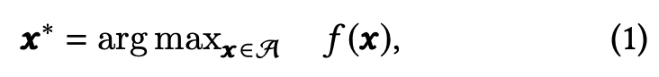
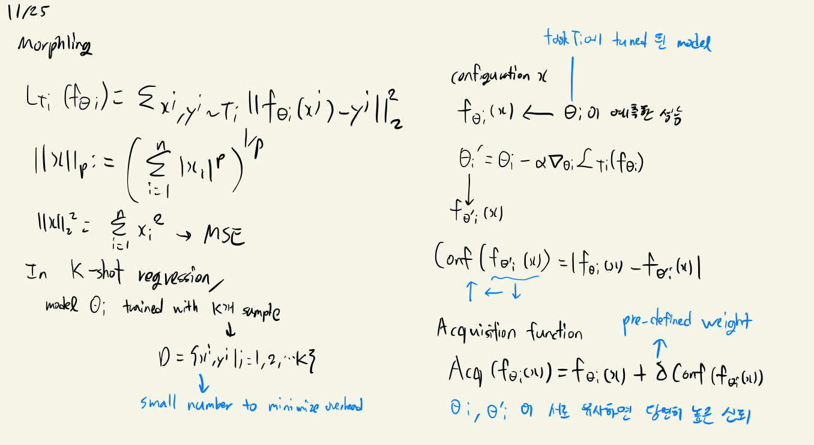
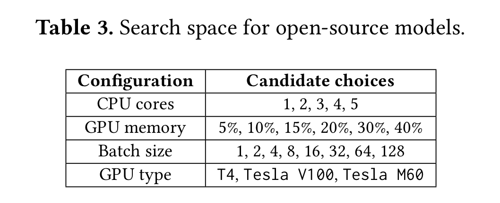
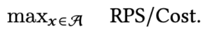
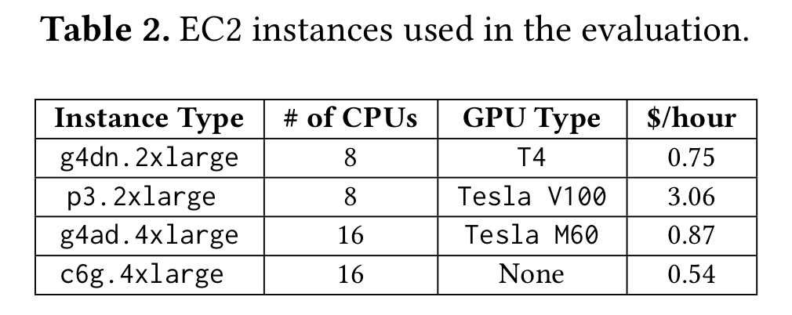

## 논문 파일

[morphling-socc21.pdf](http://home.cse.ust.hk/~weiwa/papers/morphling-socc21.pdf)

## 필요한 사전 지식

- Bayesian optimization, linear regression, transfer learning
- meta learning  
[https://rhcsky.tistory.com/5](https://rhcsky.tistory.com/5)
- few-shot learning problem  
[http://dmqm.korea.ac.kr/activity/seminar/301](http://dmqm.korea.ac.kr/activity/seminar/301)
- Model-Agnostic Meta-Learning for Fast Adaptation of Deep Networks  
[Model-Agnostic Meta-Learning for Fast Adaptation of Deep Networks.pdf](https://arxiv.org/pdf/1703.03400.pdf)
- Mapping function (regression tasks)
- exploration-exploitation trade-off

## 0. Abstract

- meta-learning 을 이용해서 많은 구성요소 중 최적화된 구성 모델을 찾는 Morphling 이라는 시스템을 개발하고 소개, 성능을 비교한 논문임

## 1. Introduction

### Machine-Learning-as-a-Service

- Machine-Learning-as-a-Service(MLaaS)는 모델 학습과 추론 서빙을 클라우드 환경에서 제공하는 서비스로 다양한 기술 회사들에서 현재 개발중에 있음, 특히 추론 서비스에 대해서 실시간으로 많은 요청이 들어오며( 페이스북의 경우 하루에 수십조의 요청 ), 리소스와 비용 역시 학습보다는 추론 서비싱에 많이 할애가 되는 추세임 ( AWS의 경우 90%가 추론에 쓰임 )
- 이렇게 머신러닝 실시간 추론 서비스의 중요도가 올라가는 반면 효율적으로 서비스를 배포하는 것에는 다양한 어려운 요소가 존재함,  학습된 모델이 주어지면 CPU cores, GPU type, GPU memory, GPU 공유 여부 등의 하드웨어 구성과 배치 사이즈와 같은 런타임 구성을 어떻게 선택하는지에 따라서 효율성과 성능이 달라지며 최적의 구성을 찾아야할 필요가 있음
- 실제로 Alibaba 클라우드 환경에서 테스트해본 결과 비효율적인 서빙 시스템은 80% 정도의 자원 낭비가 발생함을 확인하였고, 좋은 구성이 비효율적인 구성보다 10배 이상의 요청을 더 처리한다는 것을 발견함
- 본 논문의 저자의 목표는 수많은 구성 검색 공간에서 최적의 추론 서비스 구성을 빠르게 찾는 것임

### Prevalent auto-configuration techniques

- 기존의 모델 서빙 시스템들은 리소스 구성을 조정하지 않고 단순히 개발자가 제공한 것에 따름
- Bayesian optimization, linear regression, transfer learning와 같은 auto-configuration 기술은 저차원 구성 공간에서 잘 수행됨
- 저차원 구성 공간에서는 클라우드 작업 부하를 잘 조정하지만 작업 공간이 늘어나면 최적점을 찾기위한 large sampling overhead가 증가하여 비효율적임
- Morphling의 핵심 키는 하드웨어와 런타임 구성이 다양한 ML모델들에 대해서 일반적인 성능 패턴이 있다는 것임
- 즉 다양한 모델임에도 similiar tendency가 있음 따라서 few-shot learning problem을 공식화하고 MAML(model-agnostic meta-learning) 기술을 사용하여 다양한 하드웨어와 런타임 구성 환경에서 성능이 어떻게 변하는지 포착하고자 함

### Model-Agnositic Meta-Learning

- 검색 공간에서 최적의 구성을 찾는 것을 few-shot learning problem으로 공식화 하고 메타러닝 기법을 통해 문제를 해결함
- 특히 하드웨어 및 런타임 구성에서 추론 성능이 일반적으로 어떻게 변경될 수 있는지 포착하는 메타 모델을 오프라인으로 훈련함
훈련된 메타 모델은 구성 검색 과정 이전에 정보를 제공하며 학습 프로세스의 좋은 초기화 모델로 사용됨
- 새로운 추론 서비스가 주어지면 Morphling은 온라인으로 few-shot learning을 수행함, 적은 수의 구성을 샘플링하고 프로파일링된 결과를 사용하여 메타 모델을 새 서비스에 적용함
- 적용된 메타 모델은 추론 서비스 성능을 정확하게 예측하여 최적의 구성을 빠르게 검색하고 찾을 수 있음
- Tensorflow model zoo에서 제공하는 42개의 모델(이미지 분류&자연어처리)들을 가지고 Morphling 시스템을 평가함
720개의 옵션으로 구성된 대규모 검색 공간에서 5% 미만을 샘플링하여 최적의 구성을 신속하게 식별함, 기존의 방법인 auto-configuration 기술은 3~22배 더 많은 구성을 샘플링 해야 최적의 구성을 찾을 수 있음

## 2. Background - 추가 

## 3. The Need for Configuration Tuning

- 추론 서비스의 성능이 리소스와 런타임 구성에 크게 의존한다는 것을 경험적으로 보여줌.
- 구성 최적화 문제를 공식화하고 기존 접근 방식의 비효율성을 논의

### 3.1 Identifying Import Configuration

- 추론 서비스는 일반적으로 컨테이너에서 실행되며 Alibaba 클라우드에서는 SLO(서비스 응답 시간 목표)를 위반하지 않고 제공할 수 있는 최대 RPS(초당 요청 수)로 컨테이너의 제공 기능을 측정

### 3.2 Problem Formulation and Objective

잘 훈련된 ML 모델이 주어지면 클라우드 운영자는 성능, 리소스면에서 효율적인 모델을 제공하기 위해  최적의 리소스, 런타임 구성을 찾아야함

- 각 구성 x에 대해서 M가지의 구성 경우의 수를 벡터로 나타냄. 구성 x(i)는 구성 내의 모델 후보 n(i)로 이루어져 있음
- 구성 x = {x1, x2, ... xM) 벡터에 대해 아래의 수식을 가지는 목적함수 f(x)에 대해 모든 구성 중 목적함수 값이 가장큰 구성인 x*를 찾는 것이 목표임
    
    
    

### 3.3 Prior Art and Their Inefficiency

### Auto-Configuration Using Search

자동 구성에 또다른 접근은 샘플링을 작은 개수로 만드는 것임. 성능 평가를 위해. 세가지 알고리즘이 있음.

- Black-box search : sequential model-based optimization (SMBO)
    
    가장 최적의 구성을 찾기 위함. 검색 프로세스가 진행되는 동안 SMBO는 회귀 모델을 빌드함(가우시안 등) configuration-performance 곡선에 맞추기 위해 진행됨. 샘플링 예산이 소진될 때 까지 다음의 구성을 무한 루프를 돌며 샘플링함
    
    SMBO중 가장 유명한 것은 베이지안 optimization임. 하지만 저차원 검색에서는 효율적인 반면 큰 고차원 구성 공간을 탐색하는데 매우 비쌈. 따라서 캡처 6에서 추론 서비스에 베이지안이 비효율적임을 보일 에정.
    
- White-box prediction
    
    특정 구성에서 성능을 예측하고 이를 사용하여 검색 프로세서를 구동하는 접근 방식.
    
    구성에 따라서 성능이 어떻게 변경될 수 있는지에 대한 사전 지식을 사용하여 몇 가지 샘플링으로 회귀 모델을 구축하는 것이 특징. 하지만 고차원의 configuration-performance 평면은 너무 복잡하여 몇 가지 샘플링으로는 거의 적합하지 않음
    
- Similarity-based search(유사성 기반 검색)
    
    각 tuning과 벤치마킹 워크로드 사이의 유사성을 측정하고 이를 사용하여 검색 프로세스를 안내함
    
    주로 현재 작업 부하와 이전에 연구된 벤치마크 간의 일대일 유사성에 초점을 맞춤. 세션6에서 유사성 기반 검색은 최적의 구성을 찾기 위해 큰 구성 공간을 샘플링 해야 함.
    

## 4. Algorithm Design

### 4.1 Common Performance Trend

RPS(Request Per Second)가 유형의 리소스를 더 많이 구성하여 향상되지만 병목 현상이 다른 리소스 (GPU memory to CPU cores)로 이동함에 따라 성능 향상이 감소하는 경향이 있음을 관찰.

GPU Memory는 최소 요구 조건에 해당됨, 예를들어 높은 batch의 경우 GPU Memory가 부족할 경우 아예 작업 수행이 되지 않음

리소스, 런타임 구성은 다른 ML모델을 실행하는 다양한 추론 서비스에 일반적인 성능 영향을 미침.

Resource Configuration :  GPU Mem, CPU Cores

- 대규모 모델을 로드하거나 대규모 요청 배치를 제공하려면 대용량 GPU 메모리 필요
- CPU코어가 많을수록 성능이 약간 향상됨

Runtime Parameters: batch size

각 모델마다 구성 별로 성능 전환점이 존재하고 이러한 동기로 메타 학습 기술을 사용하여 빠른 자동 구성 접근 방식을 유도. 일반 추론 서비스에 대해 공통 구성 성능 추세를 포착하는 메타 모델을 오프라인으로 훈련함.

### 4.2 Meta-Model Training

### Few-shot Regression

- 공식 이해
    
    
    

K개의 샘플 데이터는 학습 오버헤드를 최소화 하기 위해 (전체 space의 5% 정도를 차지) 굉장히 작은 숫자가 될 것이고 이것이 한계이다.

### Model-Agnostic Meta-Learning (MAML)

K-shot 회귀의 약점을 보완하기 위함. 두 가지의 stage로 회귀 모델을 학습시킴

- Stage-1 : Meta-Model Training
    
    set of regression tasks를 
    
    기능 학습의 관점에서 메타 모델 훈련은 기본적으로 많은 관련 작업에 광범위하게 적용할 수 있는 국가 간 표현을 구축한다. 메타 모델은 나중에 SGD를 사용하는 새로운 회귀 작업에 적응하므로 나중에 SGD 프로세스가 과도하게 적합되지 않고 빠르게 진행될 수 있도록 훈련해야 한다. 따라서 메타 모델 𝛽는 T에서 샘플링한 과제, 즉 ←←𝜃𝑚-𝛽 L(𝑓)에 대해 최적화하도록 훈련된다. 여기서 is는 메타 훈련 단계의 학습 단계이고 𝜃i는 Eq(3) 이후의 초당 d 단계에서 계산된 과제 𝑇𝑖에 대한 미세 조정 모델이다. 알고리즘 1은 메타 모델의 훈련 과정을 자세히 설명합니다.
    
- Stage-2 : Fast Adaptation
    
    메타 모델 𝜃𝑚이 학습되면 새 작업 𝑇𝑖에 대한 초기 회귀 모델로 사용되며 𝑇𝑖에 더 잘 맞도록 미세 조정 프로세스가 뒤따릅니다(Eq. (3) 참조). 메타 훈련은 빠른 적응을 가능하게 하기 위한 것이기 때문에 이러한 미세 조정은 몇 개의 데이터 포인트로 빠르게 수렴됩니다. 이는 매개 변수의 작은 변경과 같이 작업의 변경에 민감한 메타 모델 𝜃𝑚을 찾는 것을 목표로 합니다. 모든 𝑇𝑖 의 손실을 크게 개선할 것입니다. 다음으로 빠른 적응과 함께 훈련된 메타 모델을 사용하여 최적의 구성을 검색하도록 지시하는 새로운 SMBO(순차적 모델 기반 최적화) 접근 방식을 개발합니다.
    

### 4.3 Directing SMBO Search with Meta-Model

학습된 meta-model을 가지고 최적의 구성을 찾기 위해 SMBO를 이용함.

- Standard form
    
    SMBO(Sequential Model-Based Optimization) 작업을 수행.
    
    회귀 모델에 대해서 랜덤하게 초기화 → 모델 fitting과 그 모델을 쓸지 말지 결정하는 과정을 반복함
    회귀 검색은 표본 추출 예산(특정된 예산)이 부족할 때 까지 진행함. 탐사와 착취(exploitation) 사이에서 균형을 잡는 것이 중요한데 획득 함수가 회귀 모델에 의해 만들어진 예측의 평균과 분산을 모두 결합해서 절충을 탐색하기 위해 정의됨
    
- Meta-Model as an Initial Regression Model
    
    Standard form과 달리 학습된 meta-model인 𝜃𝑚를 처음에 사용함, 서치 과정 동안 새로운 inference service(Ti에 의해 회귀 작업이 된)에 적응을 함
    
- Exploration-Exploitation Trade-off
    
    만약 알고리즘 exploitation만 한다고 가정하면, 항상 높은 예측으로 구성을 샘플링 → 검색이 로컬 환경에 최적 상태로 고정되게 쉬움
    따라서 exploration(검색)과 exploitation(부당한 사용) 사이의 균형을 맞추는 것이 중요함
    그러나 예측의 불확실성에 대해 알기가 어렵고 prediction confidence(예측 신뢰도)라는 것을 정의하여 이 문제를 해결함
    

### 4.4 Why do we use Meta-Learning?

- 메타 학습에서 오프라인으로 훈련된 메타 모델은 추론 서비스의 일반적인 기능, 일반적인 성능 추세를 자동으로 포착함.
- configuration search를 할 때 정보와 오버피팅이 되지 않은 사전 정보를 제공하며 새로운 추론 서비스에 몇번의 few shots을 통해 새로운 추론 서비스에 정확히 맞출 수 있음.
- 따라서 블랙박스, 화이트 박스 예측의 이점이 결합됨.

## 5. Cloud-Native Implementation - 추가 

- Kubernetes에서 Golang Code 기반으로 배포됨

### Programming Interface

- 사용자 입장에서 설정해 주어야 할 것들이 나열됨

### Workflow

## 6. Evaluation

Morphling은 아래 세가지 의문점을 해소하는 시스템인지 평가함

- 구성 최적성 및 검색 비용 측면에서 기존 auto-configuration 방법과 비교하여 성능적 이점이 있는가? (6.1.2 & 6.2)
- 다양한 성능 목표를 지원할 수 있는가? (6.1.2)
- 어떻게 새로운 구성 작업에 대해서 빠르게 적응할 수 있는가? (6.1.3)

### 6.1.1 Methodology

### Open-Source Models

15개의 모델 종류를 가지고 총 45개의 모델을 사용함, Tensorflow model zoo에서 제공받음

- 이미지 분류 모델
    - ResNet(5), NASNet(2), VGG(2), Inception(2), DenseNet(1), MobileNet(2), EfficientNet(7)
- 자연어 처리 모델
    - BERT(2), ALBERT(4), ELMo(1), NNLM(2), Small BERT(4), Word2vec(2), ELECTRA(2), Universal Sentence Encoder(4)

Docker container에 해당 모델과 서빙 프레임워크를 패키징함 컨테이너 시작 시 리소스와 배치 크기를 구성할 수 있도록 인터페이스를 구성함

### Search Space

모델 서빙 컨테이너에 대해 아래의 조정가능한 요소를 고려함

- CPU Cores, GPU memory, 요청된 배치 크기, GPU 유형

각 구성에 대해서 오프라인에서 측정을 수행하여 검색 공간을 결정함, 예를 들어 5개 이상의 CPU 코어가 있는 구성은 추론의 초당 요청 처리량을 더이상 개선할 수 없기 때문에 고려하지 않음.

표3은 각 구성에 대한 선택 사항을 나타냄. 총 720가지의 구성 옵션이 존재하며 이는 기존의 클라우드 구성 작업과 비교하면 큰 것으로 간주됨. 기존 연구인 Cherrypick, Scout에서 연구한 VM 구성의 검색 공간에는 수십개 정도임.

### Objective

Morphling은 구성 조정의 목적을 비용당 서비스 처리량을 최대화하는 방향으로 설정함

- RPS / Cost가 최대가 되게 하는 것이 목표임, 논문의 공식은 다음과 같음
    
    
    
    Cost = 기본 비용 + GPU 가격 * GPU 메모리 + CPU 가격 * CPU 코어수
    
- 본 논문에서는 표2에 사용한 인스턴스 타입과 가격에 대해 정리해둠
    
    
    

### Morphling Settings

- Morphling에서 사용하는 meta-model은 2개의 hidden layer와 128개의 hidden unit들로 구성된 신경망임
- Tensorflow model zoo에서 제공받은 42개의 모델 중 10개를 meta-training 용으로 사용하고 나머지는 테스트용으로 사용함
- 공정하고 재현 가능한 비교를 위해 CPU 코어, GPU 메모리 및 배치 크기의 최대값과 최소값을 포함하여 초기 샘플링 지점으로 8개의 고정 구성을 선택함
- 구성을 초기 지점으로 샘플링하는 것이 Bayesian optimization에서 최상의 성능으로 이어지는 반면 Morphling은 초기 선택에 다소 둔감하다는 것을 발견

### Baselines

5가지 기본적인 auto-configuration 알고리즘과 Morphling을 비교

1. Bayesian optimization(BO)
2. Ernes :  각 작업에 대해서 전용 회귀 모델을 구축하고 몇 가지 샘플링으로 이를 학습. Morphling에서와 동일한 신경망 아키텍처를 사용하지만 처음부터 각 추론 서비스에 대해 학습함
→ Morphling의 Algorithm1을 생략한 버전
3. Google Vizier : 새로운 검색을 가속화하기 위해 전이 학습을 사용하는 유사성 기반 검색 프레임워크
→ 전이 학습 기반, Morphling은 메타 러닝 기반
4. Fine-Tuning: 다른 간단하면서도 효과적인 유사성 기반 검색 접근 방식. Morphling과 유사하게 10개의 ML 모델을 사용하여 회귀 모델을 오프라인으로 학습합니다. 그러나 목적이 fast adaption을 고려하지 않고 단순히 평균 예측 정확도를 향상시키는 것.

### Metrics

- 목적 함수 값에 의해서 선택된 구성에서의 성능 파악
- 특정 성능 요구 사항에 충족되는 구성을 찾는데에 드는 검색 비용 파악

### 6.1.2 Performance, Cost, and Generality

### Search Quality and Search Cost

- Morphling과 Baseline에서 언급한 5가지의 auto-configuration 방식을 사용하여 32개의 테스트 모델 모두의 구성을 조정함
- 동일한 샘플링 예산으로 항상 다른 5가지의 방법보다 더 나은 구성을 찾음
- Morphling은 30개 이하의 구성 ( 검색 공간의 5% 미만) 을 샘플링하여 모든 모델에 대한 최적의 구성을 식별함, 두번째로 좋은 알고리즘인 Fine-Tuning 방법은 200개의 구성을 샘플링해야 하고 여전히 모든 모델에 대한 최적의 성능을 보장하지는 못함

그림 6b는 특정 성능 요구 사항을 충족하기 위해 다양한 접근 방식에 필요한 검색 비용을 더 비교합니다. 여기서 막대는 10번째 백분위수와 90번째 백분위수로 확장된 오차 막대로 32개 모델을 조정하는 데 드는 중앙값 비용을 측정합니다. 모든 경우에 Morphling은 다른 기준을 능가합니다. 성능 요구 사항이 높을수록 더 효율적입니다. 특히 최적 구성(100% 최적성)을 검색할 때 Morphling은 Fine-Tuning(54개 샘플링의 중앙값 필요)보다 3배, BO 및 Google Vizier보다 9.4배, 22배 이상 효율적입니다. 어니스트 및 무작위 검색. Ernest는 VM 선택[61]과 같은 작은 구성 공간으로 더 간단한 클라우드 자동 조정 문제를 해결하는 데 효율적이기는 하지만 모델 제공에 의해 요구되는 고차원 검색을 탐색하는 데는 부족하다는 점을 언급할 가치가 있습니다.

### Support of Different Objective Functions - 요약 예정

**다양한 목적 기능 지원**. 
Morphling의 고성능 및 저렴한 비용은 특정 목적 함수에 얽매이지 않고 일반적으로 광범위한 목적에 적용됩니다. 이를 보여주기 위해 이전 실험에서 정의한 것과는 대조적으로 목표 #2 및 #3이라고 하는 두 가지 조정 목표를 정의합니다. 특히, 목적 #2는 식을 기반으로 유사하게 정의된다. (7), CPU 가격을 무시한다는 점을 제외하고(CPU 가격 = 0). 운영자는 주로 고비용 GPU를 더 잘 활용하는 데 관심을 갖기 때문에 이 정의는 프로덕션 클러스터에서 정당화됩니다. 목표 #3은 금전적 비용에 관계없이 최고의 RPS를 추구하도록 설정되어 있습니다. 그림 7은 Morphling의 탐색 비용과 두 가지 목표에 따른 5가지 기준선을 비교합니다. Morphling은 기준선에 비해 이점을 유지하며 항상 30개 샘플링 내에서 최적의 구성을 반환합니다. 그림 6b와 비교하여 BO는 두 가지 새로운 목표에서 급격한 효율성 저하를 확인했으며 최적의 구성을 찾기 위해 400개 이상의 샘플링(검색 공간의 55%)의 중앙값이 필요합니다. 우리는 가장 높은 RPS를 찾는 것과 같은 목표로 인해 종종 BO가 쉽게 고착될 수 있는 여러 로컬 최적이 있는 매우 고르지 않은 구성-성능 평면이 생성된다는 점에 주목합니다.

### 6.1.3 Microbenchmark

새로운 회귀 작업에 대한 빠른 적응. 
Morphling의 높은 효율성은 메타 모델을 새로운 추론 서비스에 빠르게 적응시키는 능력에 기인합니다. 이를 설명하기 위해 언어 모델 NNLM-128 [54]에 대해 GPU 메모리와 최대 배치 크기의 두 가지 구성 노브를 조정하는 것을 고려하고 그림 8에 메타 모델의 적응을 묘사합니다. 그림 8d는 구성 - 모델에 대해 수동으로 측정된 RPS 평면. 구성 샘플링 프로세스 동안 회귀의 목표는 이 매핑 평면을 맞추는 것입니다. 무화과 도 8a, 8b 및 8c는 초기 메타 모델 𝜃 *(초기 회귀 모델), 8개의 초기 샘플링 후 및 28개 샘플링 후의 적응 모델에 의해 제공된 매핑 평면을 각각 시각화합니다. 메타 모델은 초기 단계에서 8개의 고정 구성을 샘플링한 후 기본 정보에 빠르게 적응합니다. 28번의 샘플링 직후, 미세 조정된 회귀는 대상에 정확하게 맞출 수 있습니다. 이것은 Morphling이 몇 번의 샷으로 전체 최적값을 찾을 수 있는 이유를 설명합니다. 이에 비해, Fig. 9는 28번의 샘플링 후에 장착된 평면이 ground truth와 멀리 떨어져 있는 동일한 모델 NNLM-128[54]에 대한 BO의 피팅 과정을 시각화합니다.

검색 경로. 
빠른 적응과 함께 Morphling의 검색 경로를 추가로 설명하기 위해 고정된 초기 샘플링 후 처음 10개의 샘플링된 구성을 설명합니다. Universal-Sentence-Encoder[20](notion://www.notion.so/un.se.en)와 EfficientNetb5[59](notion://www.notion.so/effic.5)의 두 가지 ML 모델을 고려합니다. 조정 목표는 Eq.로 설정됩니다. (7). 철저한 프로파일링은 effic.5 및 un.se.en에 대한 최적의 구성이 ⟨3 CPU 코어, 5% GPU 메모리, V100, 배치 크기 8⟩ 및 ⟨1 CPU 코어, 10% GPU 메모리, T4, 배치 크기 128임을 보여줍니다. ⟩, 각각.
그림 10a는 2차원 공간에서 두 모델의 탐색 경로를 시각화한 것이다. 두 검색 모두 동일한 지점(1 CPU 코어, 배치 크기 16)에서 시작하지만 각각의 최적(별표로 표시)으로 이어지는 다른 경로로 확장됩니다. 유사한 결과가 그림 10b에도 나와 있습니다. 여기서 Morphling은 T4가 un.se.en에 가장 적합하고 V100이 effic.5에 가장 적합하다는 것을 빠르게 식별합니다.

## 6.2 Serving Production Models in Alibaba

우리는 최적의 성능을 위해 추론 서비스 구성을 자동 조정하기 위해 Alibaba의 프로덕션 클러스터에 Morphling을 배포했습니다.
프로덕션 추론 서비스. 평가에는 회사의 온라인 소매 비즈니스를 지원하기 위해 널리 배포된 30가지 생산 추론 서비스가 포함됩니다. 그들은 상품 분류, 프로덕션 추천, 객체 감지, 비디오 처리, 음란물 감지 등을 위한 최첨단 ML 모델을 실행합니다. 클러스터에서 실행 중인 총 364개의 컨테이너 인스턴스가 있습니다. 각 서비스 컨테이너는 ML 모델과 데이터 압축, 기능 추출, 적법성 검사 등과 같은 복잡한 전/후 처리 파이프라인을 모두 포함합니다. 소스 모델(§6.1).

구성 조정을 위한 검색 공간. 우리의 평가에서는 우리의 경험에 따라 최고의 성능-비용 비율을 제공하는 T4 GPU를 사용합니다. Morphling을 사용하여 각 추론 서비스에 대해 (1) CPU 코어, (2) GPU 메모리 크기, (3) GPU 시간 공유의 세 가지 구성 노브를 조정합니다. 앞서 언급했듯이 Alibaba는 GPU가 여러 컨테이너에 의해 시간 다중화되는 동시에 이러한 컨테이너 간의 강력한 격리를 보장하는 GPU 공유 기술을 개발했습니다. 이 기술을 사용하면 CPU와 동일한 방식으로 GPU를 컨테이너에 할당할 수 있습니다. 표 4에는 각 구성 노브에 대한 가능한 선택 사항이 요약되어 있습니다. 검색 공간에는 총 100개의 구성 옵션이 있습니다.00

목적. 기존 연구와 동일한 구성 조정 목표, 즉 금전적 비용당 서비스 RPS를 최대화하는 것으로 설정했습니다(식 (7)). GPU 시간 공유 비용을 반영하기 위해 새로운 용어가 추가된 §6.1에 지정된 동일한 비용 모델을 가정합니다. 공식적으로 비용 = 기본 비용 + GPU 메모리를 정의합니다. 가격 × GPU 메모리 + GPU SM 가격 × GPU 시간 공유 + CPU 가격 × CPU 코어 수. 여기서 T4 가격을 GPU SM의 경우 0.2 USD, GPU 메모리의 경우 0.2 USD로 나눕니다. 다른 모든 설정은 §6.1에서와 동일하게 유지됩니다.

알고리즘 설정 및 측정항목. 우리는 튜닝 알고리즘을 위한 훈련 세트로 5개의 추론 서비스를 사용합니다. 3개는 이미지 분류, 2개는 비디오 처리에 사용합니다. 나머지 25개 서비스는 평가에 사용됩니다. 각 조정 알고리즘은 처음에 CPU 코어와 GPU 메모리 모두의 최대값과 최소값을 포함하는 4개의 고정 구성을 샘플링합니다. 여기서 GPU 시간 공유는 20%로 설정됩니다. 알고리즘에 의해 조정된 각 추론 서비스에 대해 철저한 검색을 통해 찾은 최적의 성능으로 측정된 성능을 정규화합니다.

평가결과. 그림 11a는 다양한 샘플링 예산에서 25가지 추론 서비스에 대해 서로 다른 알고리즘에서 권장하는 구성의 정규화된 성능을 비교합니다. 그림 11b는 최적의 구성을 찾기 위해 해당 알고리즘에 필요한 검색 비용을 추가로 비교합니다. Morphling은 구성 성능과 검색 비용 모두에서 5가지 기준을 선도합니다. 특히 Morphling은 중앙값 9개, 최대 19개로 최적 구성을 식별합니다. 이는 기준선보다 훨씬 더 효율적입니다. 이 중 Fine-Tuning이 선두주자이며 Google Vizier, BO, Ernest , 및 임의 검색. 이 결과는 이전 평가(§6.1)와 일치합니다. Morphling의 경우 프로덕션 서비스 튜닝의 검색 비용(100개 옵션 중 9개 샘플링의 중앙값)은 오픈 소스 모델 튜닝(720개 옵션 중 18개 샘플링의 중앙값)보다 약간 높습니다. 이는 후자가 더 많은 구성 노브를 가지므로 더 큰 검색 공간을 가질 것으로 예상되며, 이에 대해 메타 학습은 일반적으로 기존 검색 접근 방식보다 더 높은 성능 이점을 나타냅니다.

간접비. Morphling에서 구성 조정 오버헤드는 주로 서비스 및 클라이언트 컨테이너 시작, 최대 RPS 스트레스 테스트 및 결과 수집을 포함하여 각각 약 10-15분이 소요되는 시험(§5.1)에서 나옵니다(그림 5). 이러한 작업 중 서비스 시작은 프로덕션 환경의 복잡한 배포 종속성으로 인해 일반적으로 가장 많은 시간이 소요됩니다. 이에 비해 메타 모델 적응을 위한 계산 시간은 무시할 수 있으며 완료하는 데 몇 초가 걸립니다. 메타 모델 훈련의 경우 일반적으로 10분 이내에 수천 번의 반복으로 수렴됩니다. 메타 모델은 한 번만 훈련하면 되므로 이러한 오버헤드는 오프라인이며, 이후 몇 번의 학습을 통해 온라인에서 새로운 서비스에 적응하는 데 재사용할 수 있습니다.

## 7. Discussion - 요약 예정

기타 구성 문제에 대한 응용 프로그램. 메타 학습 기반 검색 접근 방식은 추론 서비스를 조정하는 데 국한되지 않고 다른 클라우드 구성 문제로 확장될 수도 있습니다. 실제로 일부 수정을 통해 Redis[13]와 같은 클라우드 스토리지 서비스의 구성 매개변수 및 리소스 할당을 조정하기 위해 Morphling을 성공적으로 사용했습니다. 그렇긴 하지만 메타 학습은 조정 가능한 노브가 다른 컴퓨팅 작업에서 다양하거나 한 작업에 대한 지식을 다른 작업으로 쉽게 이전할 수 없는 문제에 적합하지 않습니다. 예를 들어, 신경망 아키텍처를 조정할 때[37, 58, 71, 72], 셀 구조와 같은 하이퍼 매개변수는 데이터 세트 간에 잠재적으로 일반화될 수 있지만 네트워크의 너비와 깊이는 현재 훈련 작업에 크게 의존합니다. 이러한 하이퍼 매개변수의 경우 지식 이전은 조정 프로세스를 가속화하는 데 거의 도움이 되지 않습니다[37, 72].

메타 모델의 일반화 가능성. 메타 학습에 대한 한 가지 공통된 우려는 메타 모델이 다양한 추론 서비스로 일반화되는지 여부입니다. 다행히도 식별된 하드웨어 및 런타임 구성(예: CPU 코어 및 GPU 메모리)이 광범위한 추론 서비스에 다소 안정적인 성능 영향을 미친다는 사실을 발견했습니다. 예를 들어, 이미지 분류와 언어 모델 모두 공통 메타 모델을 적용하면 잘 맞을 수 있지만 이러한 구성에 대한 민감도는 다를 수 있습니다. 식별된 것 이외의 새로운 구성 노브를 조정해야 하는 경우, 짧은 시간(예: 10분 미만)에 완료할 수 있는 소수의 서비스에 대해 메타 모델을 간단히 재교육할 수 있습니다. §6.1에 언급된 대로).

기타 중요한 모델 제공 구성. 식별된 하드웨어 구성 외에도 RAM(메인 메모리) 및 디스크 스토리지와 같은 리소스도 추론 서비스의 품질에 영향을 미칠 수 있습니다. 그러나 이러한 리소스는 일반적으로 시스템에서 과도하게 프로비저닝됩니다. 예를 들어 EC2에서 g4dn.4xlarge 인스턴스는 64GB RAM 및 225GB 스토리지와 함께 하나의 T4 GPU를 제공하는 반면 컨테이너를 제공하는 모델에는 일반적으로 몇 GB의 RAM 및 스토리지만 필요합니다. 이러한 리소스 과잉 공급은 Alibaba의 생산 클러스터에서도 발견됩니다[66]. 따라서 우리는 할당을 조정하지 않습니다. 이전 작업[68]은 또한 병렬 처리의 잘 조정된 정도(즉, 스레드 수)가 동시 요청 처리를 가능하게 하여 파이프라인이 있는 CPU를 완전히 활용하기 때문에 ML 추론 서비스의 품질을 간접적으로 향상시킨다고 나타냅니다. 그러나 실험에서 다른 수의 서빙 스레드를 구성할 때 눈에 띄는 성능 차이는 관찰되지 않습니다. 또한 네트워크 및 I/O 대역폭은 추론 서비스에 상당한 성능 영향을 미칠 수 있습니다. 우리 알고리즘은 자동 조정을 위한 또 다른 구성 노브로 쉽게 포함할 수 있지만 EC2와 같은 퍼블릭 클라우드 및 프로덕션 클러스터의 컨테이너 수준에서 할당을 쉽게 시행할 수 없기 때문에 포함하지 않기로 결정했습니다.

## 참조

- 웹사이트
    
    [https://kubedl.io/docs/prologue/introduction/](https://kubedl.io/docs/prologue/introduction/)
    
    [https://kakaobrain.com/blog/106](https://kakaobrain.com/blog/106)
    
    [https://engineering-ladder.tistory.com/95](https://engineering-ladder.tistory.com/95)
    
    [https://velog.io/@sjinu/Few-Shot-Learning](https://velog.io/@sjinu/Few-Shot-Learning)
    
- 깃헙
    
    [https://github.com/kubedl-io/morphling](https://github.com/kubedl-io/morphling)
    

### Model-agnostic meta-learning for fast adaptation of deep networks.
    
- 고려대 랩실
[http://dmqm.korea.ac.kr/activity/seminar/265](http://dmqm.korea.ac.kr/activity/seminar/265)
    
    세미나 참고 자료
    
    [0719세미나_목충협.pdf](https://s3-us-west-2.amazonaws.com/secure.notion-static.com/67ab5712-2520-4b88-b0b6-b7129a969124/0719세미나_목충협.pdf)
    

### A tutorial on Bayesian optimization.

- 논문
    
    [A Tutorial on Bayesian Optimization.pdf](https://arxiv.org/pdf/1807.02811.pdf)
