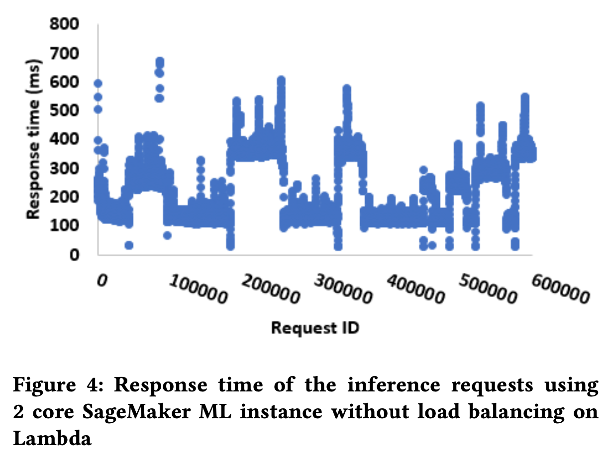

# SLA-aware Workload Scheduling Using Hybrid Cloud Services

## Abstract

- bursty 한 워크로드에 대해서 auto scaling하는 것은 도전 과제이며 SLA 위반의 결과를 초래함, 클라우드 환경에서 리소스를 과도하거나 적게 프로비저닝 할 경우 성능 저하 혹은 비용 낭비의 문제가 발생함
- 본 논문은 온프레미스 환경과 스케일링이 용이한 서버리스 아키텍처상에서의 bursty한 워크로드의 특성들을 파악하고 스케줄링함
- 딥러닝 추론 워크로드에서 로드 밸런싱을 위해 AWS의 Sagemaker와 Lambda를 사용

## 핵심 내용

- bursty한 워크로드에서 높은 확장성과 비용 효율적인 특성을 서버리스 플랫폼이 해결책이 될 수 있음
- 워크로드 특성을 파악하고 효율적인 인스턴스에 해당 워크로드를 실행

- 딥러닝 추론 워크로드의 주요 요소
    - ML 인스턴스의 코어, 메모리에 대해 가장 적절한 구성 파악
    - SLA를 위반하지 않고 처리할 수 있는 요청수를 파악
    - 서버리스 인스턴스를 위한 최적의 구성 파악

### 로드 밸런싱 구조 전반적인 이해

- 워크로드 특성에 따라서 ML instances, Serverless instances에 대해 선택
- 특성화된 워크로드의 데이터를 사용하여 몇개의 요청수까지 VM 인스턴스에서 사용할 수 있는지 이해하는 과정을 거침
- 임계점을 넘어 SLA을 위반하게 될 경우 추가 요청들을 serverless platform으로 보내여 처리함
- 적절한 구성을 식별하여 과하거나 부족하게 자원을 프로비저닝 하지 않아 성능 저하없이 비용 효율적인 서빙을 함

### 실험 환경

- On-premise
    - Sagemaker Jupyter notebook
    - Intel Xeonn 1359v2@2.45 GHz, 28 cores, 256GB memory
- Serverless
    - AWS Lambda
### On-premise 워크로드 특성

- 하나의 요청을 처리할 경우, cores 2 → 4 로 늘렸을 때 상당한 성능 증가가 일어남
나머지의 경우 코어를 늘려서 응답 시간이 향상되지 않음
따라서 하나의 요청을 처리할 경우 core를 4로 설정하는 것이 적절함
- 람다에서 10GB까지 메모리를 늘렸을 때에 core는 6개를 사용하지만 우리는 figure2에서의 관찰을 통해 core수를 4까지로 제한을 둠 이 결론으로 약 35%의 코스트 이득을 봄

- Figure2에서 파악한 특성을 통해 우리는 최대 동시 처리량을 파악하여 ML instance에서 SLA 위반이 없도록 서빙을 할 수 있음
- 예를 들어 모델이 ml.c5.2xlarge(8 cores)에 배포되어 있고 SLA에 응답시간이 최대 150ms로 정의되어 있다면 5개의 동시 처리량 이상을 서빙할 수 없다는 것을 알 수 있음.
따라서 이러한 정보로 추가적인 요청에 대해서는 람다가 처리하도록함

### ML 인스턴스와 서버리스 인스턴스 스케줄링

- Figure3은 bursty한 워크로드 샘플을 나타냄, 요청 수는 5 ~ 20 까지이며 SLA에 정의된 최대 요청 처리 시간은 200ms임
- Figure2에서의 정보를 이용하여 ml.c5.large(2 cores)에 논문 저자의 추천시스템 모델을 배포함, 해당 인스턴스는 200ms 안에 5개의 동시 요청 수를 처리할 수 있음

  

- Figure4는 서버리스 인스턴스 없이 Figure3의 워크로드를 처리한 경우의 응답 처리 시간을 나타냄, SLA에 정의된 200ms를 넘어 상당한 위반률을 기록함
- Figure5는 서버리스 인스턴스를 저자의 로드밸런싱을 이용하여 추가 했을 경우의 응답 처리 시간을나탄냄, 동시 요청 수가 5를 넘는다면 나머지 처리를 람다에서 처리하는 방식임
- SLA 위반이 상당히 줄었으며, Figure6에서 나타나는 람다에서의 응답 처리 시간은 200ms안에 서빙함 (실제 Figure에는 200ms가 넘는 경우가 보이나 논문에는 이렇게 서술 되어 있음)

### 결론 및 향후 계획

- on-premise 워크로드 특성을 아는 것은 비용 효율적, SLA 수용 가능한 추론 워크로드 스케줄링에 유용함
- 또한 서버리스 플랫폼의 auto-scaling 특성을 이용하여 성능 저하 없이 비용 절감의 효과를 봄
- 현재의 실험으로, 람다의 clod start 특성에 의해 약간의 SLA 위반의 경우를 확인함
provisional concurreny와 해당 경우를 예측 분석하는 것이 future work임
- 또한 이 로드밸런싱 기술을 가지고 더 큰 워크로드 환경을 구성해볼 예정
